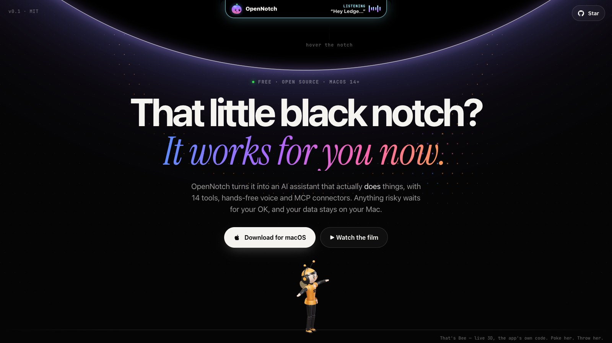
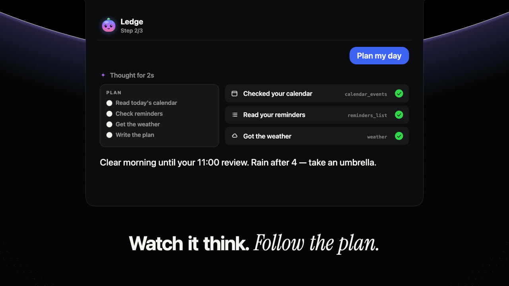
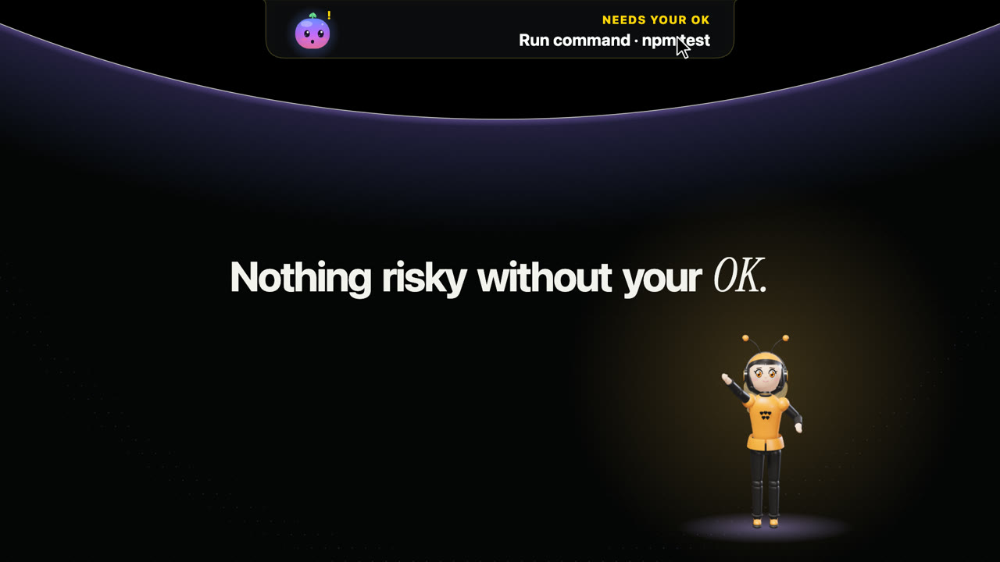
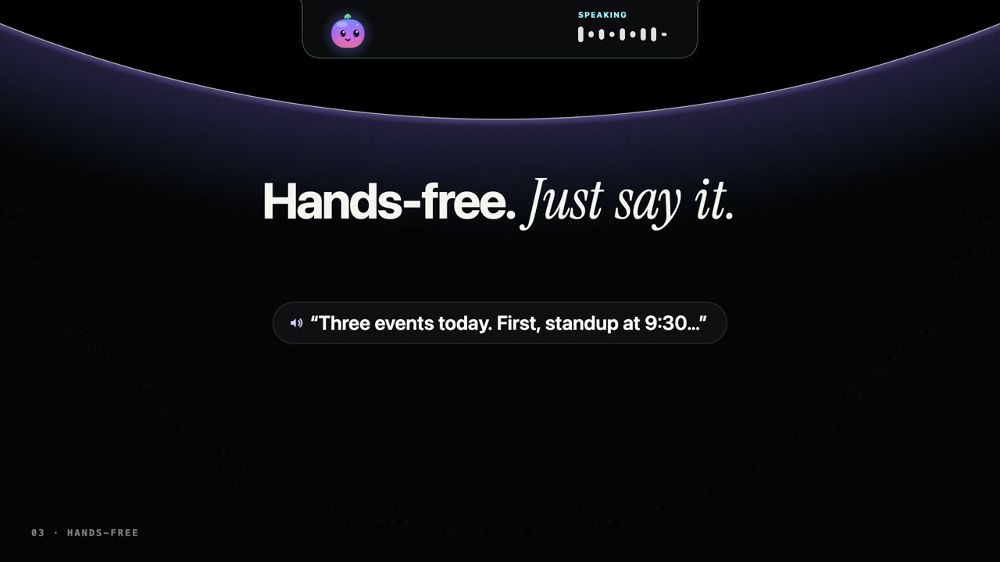
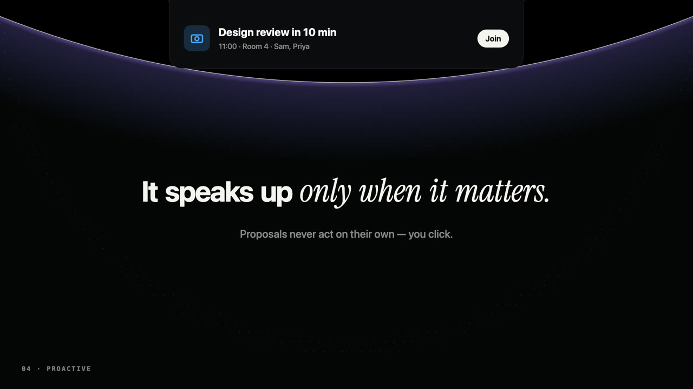
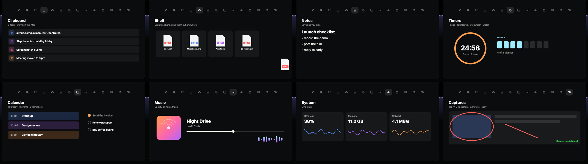
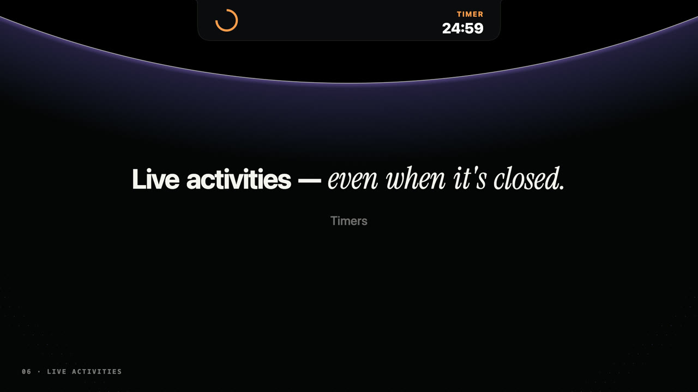
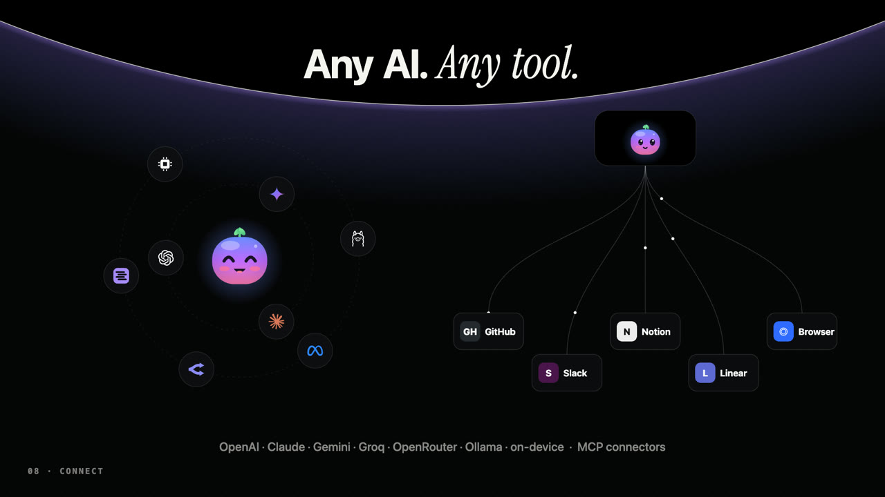
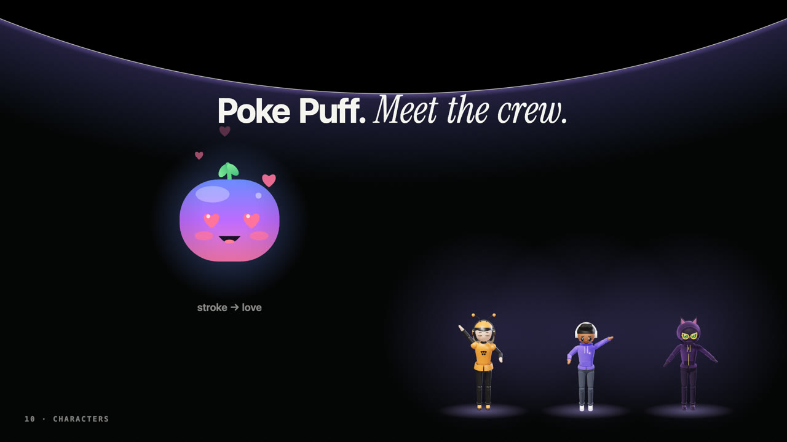
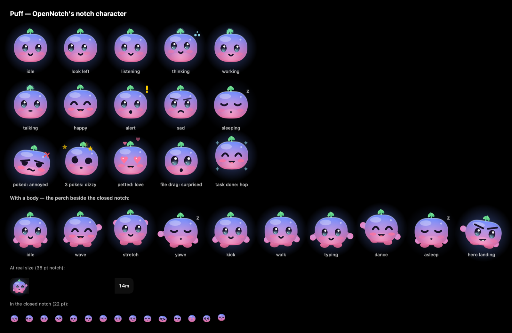

<div align="center">

# OpenNotch

**That little black notch on your MacBook? It works for you now.**

An open-source AI assistant that lives in the notch — it does real work, asks before anything risky,<br>
listens hands-free, and brings a few friends. Free, local-first, and your data stays on your Mac.

[**⬇ Download for macOS**](https://github.com/Laxman824/OpenNotch/releases/latest/download/OpenNotch.dmg) &nbsp;·&nbsp;
[**Website**](https://laxman824.github.io/opennotch/) &nbsp;·&nbsp;
[**Watch the film**](https://laxman824.github.io/opennotch/#film)

    

<a href="https://laxman824.github.io/opennotch/"></a>

<a href="https://laxman824.github.io/opennotch/#film"></a>

</div>

Hover the notch (or press **⌥Space**) and ask anything. Music, timers, clipboard, notes, calendar,
captures and a dozen more tools live there too, Dynamic-Island style. Everything runs on your Mac:
chats are stored locally, and the only network traffic goes to the AI you choose.

> **Status: early (0.1).** Works today: the notch, modules, pop-ups, the desktop companion, and the
> AI agent with tools. See [docs/ROADMAP.md](docs/ROADMAP.md) for what's next.

## It does the work



It **summarises the page you're reading**, **catches up on your Mail inbox and drafts replies** (it never
sends), searches and creates **Apple Notes**, looks up **contacts**, plans your day from your **calendar,
reminders and the weather**, and **schedules prompts** ("every weekday at 9, brief me"). It also reads
and edits files, runs shell commands, searches the web, controls music, looks at your screen, sets
timers and remembers your preferences. You can watch it **think** and follow its **plan** live, and
every chat is kept in **history** (⌘Y).

It gets to know you without snooping: after a chat it may **suggest a fact to remember** ("Lives in
Lisbon"), which is saved only when you click Save (see and delete them in Settings › AI › Memory). It can
**search your earlier chats** ("what did we decide about the logo?"), keeps long chats coherent by
**summarising** what scrolled out of its context, runs independent lookups **in parallel**, and ends
answers with **one-tap follow-ups**. Ask it something and close the notch: the ears say **Ready** when it's done.

## Nothing risky without your OK

| | |
|---|---|
|  | Commands, file changes, calendar edits, drafts and connector tools wait for you. The notch glows yellow and chimes; in hands-free mode it asks out loud — say "yes" or "no". No answer in five minutes means no. For repeated steps, **Allow for this chat** covers one program (say, `git`) or one project folder until you switch chats. **It drafts email; it never sends.** Text from web pages and emails is handed to the AI as information, never as instructions. |
|  | **Hands-free voice.** Say "Hey Ledge…", hear the answer, interrupt any time. Speech recognition runs on your Mac. |
|  | **Proactive, never pushy.** A morning brief, "meeting in 10 minutes — Join", "3 emails may need a reply — Draft replies". Proposals never act on their own. |

## 14 tools, one hover away



Assistant · Find files · Menu bar (including the icons the notch hides) · Clipboard history · Shelf
(drag & drop) · Notes · Timers & water breaks · Calendar & reminders · Music (with scrubbing) ·
System · Screen time · Image converter · AI-usage heatmap · Captures with annotation — plus a ⌘K
command palette, quick capture ("remind me to call Sam at 5", no AI needed) and live activities in
the closed notch.



**Live activities:** album art and a wave for music, timer rings, volume, AirPods, charging, system
health — and a **mic & camera indicator** that names the app using your microphone.

## Any AI. Any tool.



Open **Settings › AI** (notch menu › Settings…) and pick one:

| Option | What you need |
|---|---|
| **Sign in with OpenRouter** | An OpenRouter account — one login gives you Claude, GPT, Gemini and free models, with your own spending limit |
| **Paste an API key** | A key from OpenAI, Anthropic, Google Gemini (free tier available) or Groq — stored in your Keychain |
| **Ollama / LM Studio** | Either app running with a model downloaded — fully local and free |
| **Apple on-device** | macOS 26 with Apple Intelligence turned on — no setup, offline, with read-only tools (weather, calendar, reminders, memory) |
| Sign in with ChatGPT | Coming once OpenAI issues OpenNotch its client ID |

**Web search** works with no key (DuckDuckGo). For steadier results, pick **Brave Search** or **Tavily**
in Settings › AI › Web search and paste a key; DuckDuckGo remains the fallback.

### Connectors (MCP)

Add more tools (GitHub, Gmail, Slack, a browser…) with any [MCP](https://modelcontextprotocol.io)
server: **Settings › AI › Edit mcp.json**, using the common `mcpServers` format. Connector tools ask for
approval unless you list them under `"autoApprove"`.

## Meet Puff — and pick a desktop buddy



**Puff** is a soft jelly blob that lives in the notch. Its eyes follow your cursor; poke it and it gets
grumpy, poke it three times and it goes dizzy, stroke it and hearts float up. It hops for joy when a task
finishes and now and then peeks out to say hi. When the notch is closed, Puff sits beside it with little arms
and feet — waving, stretching, typing along with you, dancing to your music, napping when you're away, and
sometimes walking behind the camera to the other side. Ledge also **checks in**: copy an error and it offers to
explain it, work an hour straight and it suggests a break, come back and it catches you up (Settings › General ›
Liveliness: Calm, Friendly or Lively). **Ledge, Bee or Cat** jumps out of the notch on first launch
and walks on your windows, dances to your music and points at the notch when the assistant needs your OK.
More companions are on the way.



## Private by design

No account, no telemetry, no OpenNotch servers. Chats, memory and settings live in
`~/Library/Application Support/OpenNotch`; API keys live in your Keychain. Weather uses Open-Meteo, and
web fetches happen only when you ask for them.

## Install

1. **[Download OpenNotch.dmg](https://github.com/Laxman824/OpenNotch/releases/latest/download/OpenNotch.dmg)**, open it, and drag OpenNotch to Applications.
2. **First launch:** builds are not yet notarised by Apple, so macOS will say it can't verify the app.
   Open **System Settings › Privacy & Security**, scroll down and click **Open Anyway**. You only do this once.
3. **Connect an AI** in Settings › AI.

Requires macOS 14 Sonoma or later on Apple silicon (Macs without a notch get a virtual one).

## Build from source

```bash
git clone https://github.com/Laxman824/OpenNotch && cd OpenNotch
scripts/signing.sh          # once: a free local signing identity so permissions survive rebuilds
scripts/build.sh --install --open
```

Needs the Xcode Command Line Tools (`xcode-select --install`). Tests:

```bash
Checks/run.sh               # Swift logic checks + agent checks (no network)
node Desktop/test/sim.mjs   # desktop companion simulation

# One real agent turn against a provider (key from the environment, never stored):
OPENNOTCH_KEY=… App/.build/debug/OpenNotch --selftest groq        # or openai, anthropic, gemini, openrouter, ollama …

# The eval set: 24 everyday prompts, scored by the tools the model picks (nothing real is changed):
App/.build/debug/OpenNotch --eval openrouter                       # key from $OPENNOTCH_KEY or the one saved in Settings
```

## Command line

```bash
cli/opennotch "what's on my calendar?"     # ask
git diff | cli/opennotch "review this"     # pipe context in
cli/opennotch -t 25   ·   cli/opennotch --awake 60   ·   cli/opennotch -m mirror   ·   cli/opennotch -m peek
```

## Contributing

Issues and pull requests are welcome — see [CONTRIBUTING.md](CONTRIBUTING.md).

## License

[MIT](LICENSE). Bundles [three.js](https://threejs.org) (MIT). Provider logos on the website are from
[Simple Icons](https://simpleicons.org) (CC0) and belong to their owners.
